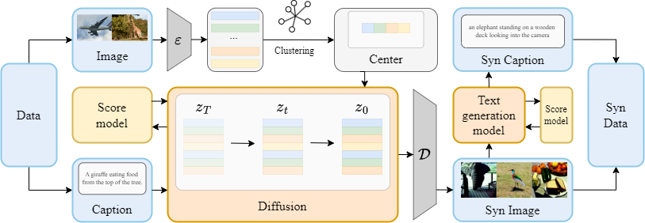
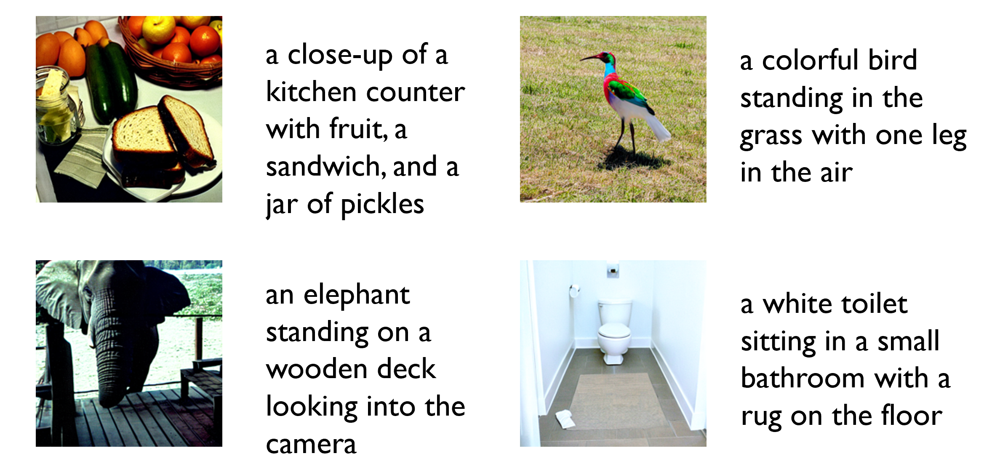

## GITD: A Generative Method for Multimodal Dataset Distillation

> Accepted by CVML 2025.

Authors: [Songlin Jiang](https://github.com/clorf6),  [Guanjie Wang](https://github.com/Irfnfnkemed), [Shuo Wu](https://github.com/xunying123)

- source code: [Multimodal-DD](https://github.com/clorf6/Multimodal-DD)
- [Paper In PDF](GITD.pdf)

### Abstract

The rapid advancement of machine learning has led to the emergence of large-scale models and massive datasets, increasing the demand for efficient data distillation techniques. This paper proposes GITD (Generative Image- Text Distillation), an innovative generative architecture for multimodal dataset distillation. GITD achieves superior text-image alignment, enhanced performance, and reduced overhead compared to traditional methods. Experimental results demonstrate significant performance improvements, with approximately 15% and 30% gains in image and text retrieval tasks, respectively. Additionally, GITD exhibits strong cross-architecture generalization, making it highly adaptable across different models.

### Architecture

Above shows the pipeline of GITD. Given a multimodal dataset, GITD firstly extracts latent embeddings from original images. Then, GITD applies CLARA Clustering algorithm to find the most representative medoids of the latent embeddings. Subsequently, using the original corresponding text as the prompt, GITD performs the diffusion process with pre-trained diffusion model on the latent embeddings of the cluster centers and decodes the generated embeddings to generate synthetic images. Finally, GITD leverages pre-trained text generation model to generate the corresponding synthetic text for synthetic images.

### Visualization of the Result

To illustrate the quality of the synthetic data intuitively, We provide visualizations of the synthetic image-text pairs for Flickr30K. As shown above, the generated images are highly realistic, and the captions are precisely aligned with the visual content, demonstrating the superior quality of the synthetic dataset.

### Credit

SJTU Course AI3604-02: Computer Vision (2024 Fall) Team D Project.

This page is maintained by AI3604-02 - Group D.
